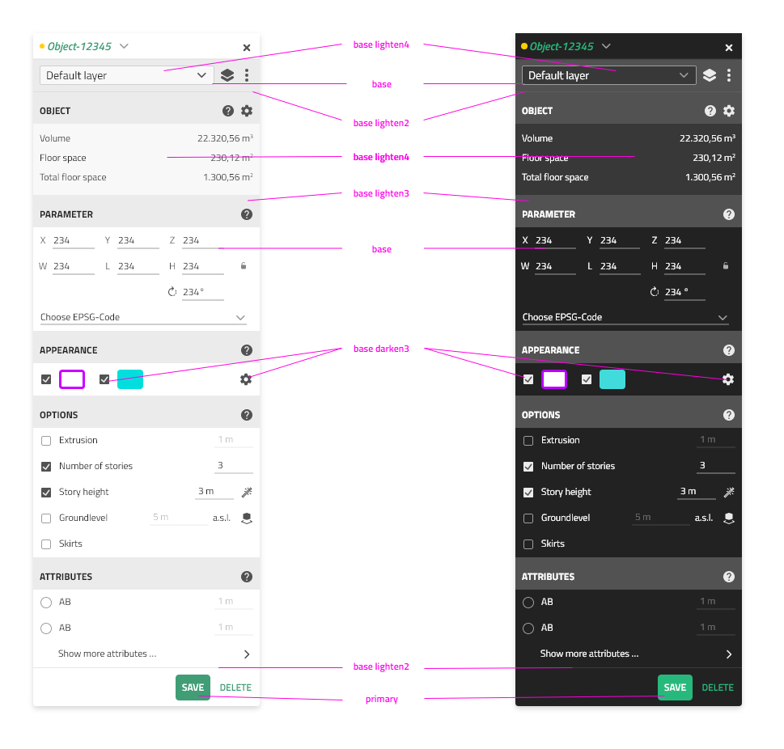

# Colors

The interface of the VC Map is based on an individual monochromatic grey color scheme (`base`) combined with one accent/cooperate 
design color (`primary`).

The primary color can be configured within a context (see [UI CONFIG](./UI_CONFIG.md)):
```json
{
  "uiConfig": [
    {
      "name": "primaryColor",
      "value": "#FFCE00"
    }
  ]
}
```
The primary color can also be configured for light/dark mode
```json
{
  "uiConfig": [
    {
      "name": "primaryColor",
      "value": {
        "dark": "#232D52",
        "light": "#ff0000"
      }
    }
  ]
}
```


The VC Map UI supports a light and a dark theme.
All components are automatically updated by vuetify on theme change.
Additionally, the [VcsUiApp](../src/vcsUiApp.js) fires a `themeChanged` event, 
when the theme changes from light to dark, vice versa or a newly added context changes the primary color.

The color palette is configured via [vuetify.js](../src/vuePlugins/vuetify.js) and is usable through
- [sass](#in-scss) variables
- [css classes](#css-color-class) or
- [javascript](#in-javascript) via `getColorByKey` API.

## VCS Color palette

The VC Map UI pre-defines a coherent color scheme for a light and dark theme.
The table below shows all color keys and corresponding hex codes.

<style>
#grid {
    display: grid;
    grid-template-columns:  1fr 1fr 10px 1fr 1fr;
    grid-gap: 10px;
    margin-bottom: 40px;
}
#grid > div {
    color: white;
    padding: 10px;
}
#grid > div.colum-spacer{
grid-area: 1 / 3 / span 13 / span 1;
}
#grid > div.row-spacer{
grid-area: 12 / 1 / 12 / 6;
}
</style>
<div id="grid">
<div class="colum-spacer"></div>

<div><b>Light theme</b></div>
<div><b>Dark theme</b></div>
<div><b>Light theme</b></div>
<div><b>Dark theme</b></div>
<div style="background:#9e9e9e"><!--light--> --v-base-base: #9e9e9e</div>
<div style="background:#9e9e9e">--v-base-base: #9e9e9e</div>
<div style="background:#409d76"><!--light--> --v-primary-base: #409d76</div>
<div style="background:#27b97c">--v-primary-base: #27b97c</div>

<div style="background:#b8b8b8; color: black;"><!--light--> --v-base-lighten1: #b8b8b8</div>
<div style="background:#858585">--v-base-lighten1: #858585</div>
<div style="background:#5cb890; color: black;"><!--light--> --v-primary-lighten1: #5cb890</div>
<div style="background:#4dd596; color: black;">--v-primary-lighten1: #4dd596</div>

<div style="background:#d0d0d0; color: black;"><!--light--> --v-base-lighten2: #d0d0d0</div>
<div style="background:#6b6b6b">--v-base-lighten2: #6b6b6b</div>
<div style="background:#78d4aa; color: black;"><!--light--> --v-primary-lighten2: #78d4aa</div>
<div style="background:#6cf2b1; color: black;">--v-primary-lighten2: #6cf2b1</div>

<div style="background:#ebebeb; color: black;"><!--light--> --v-base-lighten3: #ebebeb</div>
<div style="background:#525252">--v-base-lighten3: #525252</div>
<div style="background:#94f1c6; color: black;"><!--light--> --v-primary-lighten3: #94f1c6</div>
<div style="background:#8bffcc; color: black;">--v-primary-lighten3: #8bffcc</div>

<div style="background:#f8f8f8; color: black;"><!--light--> --v-base-lighten4: #f8f8f8</div>
<div style="background:#383838">--v-base-lighten4: #383838</div>
<div style="background:#b0ffe2; color: black;"><!--light--> --v-primary-lighten4: #b0ffe2</div>
<div style="background:#a9ffe9; color: black;">--v-primary-lighten4: #a9ffe9</div>

<div style="background:#ffffff; color: black;"><!--light--> --v-base-lighten5: #ffffff</div>
<div style="background:#ffffff; color: black;">--v-base-lighten5: #ffffff</div>
<div style="background:#cdfffe; color: black;"><!--light--> --v-primary-lighten5: #cdfffe</div>
<div style="background:#c6ffff; color: black;">--v-primary-lighten5: #c6ffff</div>

<div style="background:#858585"><!--light--> --v-base-darken1: #858585</div>
<div style="background:#b8b8b8; color: black;">--v-base-darken1: #b8b8b8</div>
<div style="background:#20825d"><!--light--> --v-primary-darken1: #20825d</div>
<div style="background:#009d63">--v-primary-darken1: #009d63</div>

<div style="background:#6b6b6b"><!--light--> --v-base-darken2: #6b6b6b</div>
<div style="background:#d0d0d0; color: black;">--v-base-darken2: #d0d0d0</div>
<div style="background:#006946"><!--light--> --v-primary-darken2: #006946</div>
<div style="background:#00834b">--v-primary-darken2: #00834b</div>

<div style="background:#525252"><!--light--> --v-base-darken3: #525252</div>
<div style="background:#ebebeb; color: black;">--v-base-darken3: #ebebeb</div>
<div style="background:#00502f"><!--light--> --v-primary-darken3: #00502f</div>
<div style="background:#006834">--v-primary-darken3: #006834</div>

<div style="background:#383838"><!--light--> --v-base-darken4: #383838</div>
<div style="background:#f8f8f8; color: black;">--v-base-darken4: #f8f8f8</div>
<div style="background:#00381a"><!--light--> --v-primary-darken4: #00381a</div>
<div style="background:#004f1e">--v-primary-darken4: #004f1e</div>

</div>

To ensure the harmonious color scheme through the whole map application, it is vital that colors are used correctly:

| Color key     | Description and usage                                                                          |
|---------------|------------------------------------------------------------------------------------------------|
| primary       | Global accent color (VCS Green)                                                                |
| accent        | Unused (vuetify standard color, replaced by: 'base lighten3' )                                 |
| base          | For input/selectbox borders (stays the same in light and dark mode)                            |
| base lighten5 | Text and icon color on standard and large buttons(VCS special: white in light and dark theme!) |
| base lighten4 | Background color for forms and input fields                                                    |
| base lighten3 | Former accent color, used in searchbar, Forms accent                                           |
| base lighten2 | Dividers(VCS special: twins light/dark theme)                                                  |
| base darken3  | Text and icon color on small buttons                                                           |
| base darken4  | Use as former secondary color                                                                  |


### Vuetify customization

The color scheme is based on the vuetify [color class system](https://vuetifyjs.com/en/styles/colors/) and overwrites it where
necessary. Customized grey color classes (`base`) are configured in the [_theming.scss](../src/styles/_theming.scss).
The overall background color based on vuetify/materials using the `$shades` variable is overwritten in the
[variables.scss](../src/styles/variables.scss).

### Text style

Text color is set by shades default settings depending on light/dark theme. 
No additional color classes should be used.

Anchor are underlined and the color is also set to shades by default. 

Icon color (`<v-icon>`) is set to shades by default.

To highlight text/anchor/icons use class (`text--primary`) as shown:
```html	 		
		<v-icon class="text--primary">
		<span class="text--primary">text</span>
```

### Usage examples

The following examples illustrate, how the color scheme can be used in vue components (or style sheets) and javascript code.

#### As color prop

A button in primary color:
```html
<VcsButton color="primary">
 ...
</VcsButton>
```
An alert:
```html
<v-alert color="base lighten-2">
  ...
</v-alert>
```

#### CSS color class

A component with text in primary color:
```vue
<MapNavCompass
  class="primary--text"
/>
```

#### In SCSS

Active item:
```scss
.v-list-item--active {
  background-color: var(--v-primary-lighten5);
  border-bottom: 1px solid var(--v-primary-lighten4);
}
```
Hovering effects:
```scss
&:hover{
  color: var(--v-base-lighten5) !important;
  border-color: var(--v-primary-base);
  background-color: var(--v-primary-base);
}
```

#### In Javascript

The @vcmap/ui package exports utility functions to access colors in javascript.
This is helpful to style a layer or feature according to the color scheme.

To get the default primary color use:
```js
import { getDefaultPrimaryColor } from '@vcmap/ui';

const defaultPrimaryColor = getDefaultPrimaryColor();
```

To access a color or color variation, you can simply do:
```js
import { getColorByKey } from '@vcmap/ui';

const primary = getColorByKey('primary');
const baseLighten2 = getColorByKey('base', 'lighten2');
```

To listen to theme changed event and update a style:
```js
import { VectorLayer, VectorStyleItem } from '@vcmap/core';
import { getDefaultPrimaryColor } from '@vcmap/ui';
import { getColorByKey } from '@vcmap/ui';

const layer = new VectorLayer();
const style = new VectorStyleItem({
  fill: {
    color: 'rgba(237, 237, 237, 0.1)',
  },
  stroke: {
    color: getDefaultPrimaryColor(),
    width: 5,
  },
});
layer.setStyle(style);


app.themeChanged.addEventListener(() => {
  const color = getColorByKey('primary');
  style.stroke?.setColor(color);
  layer.forceRedraw(); // update style on all features
});
```


## Usage within VC Map UI

The following image illustrates where different colors are used on the VC Map user interface

